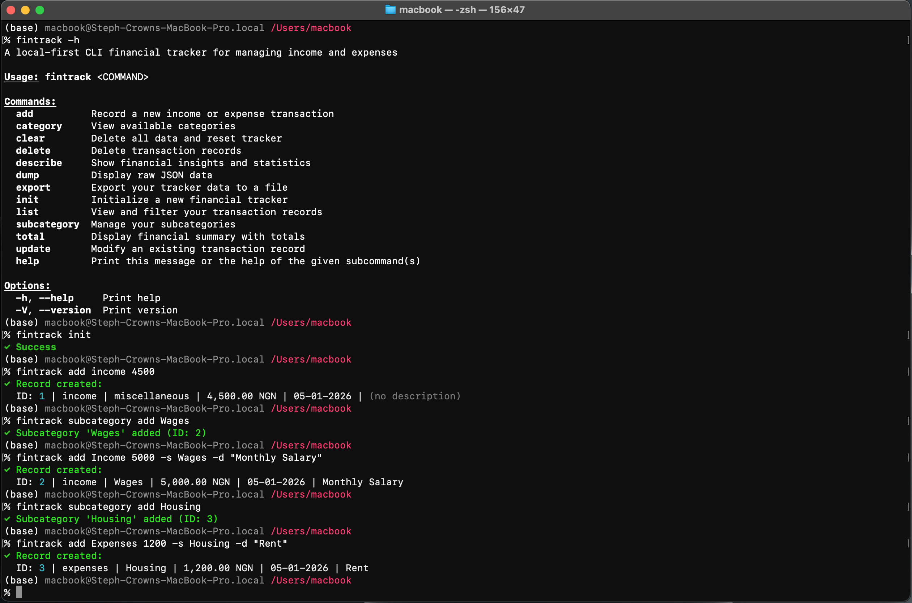
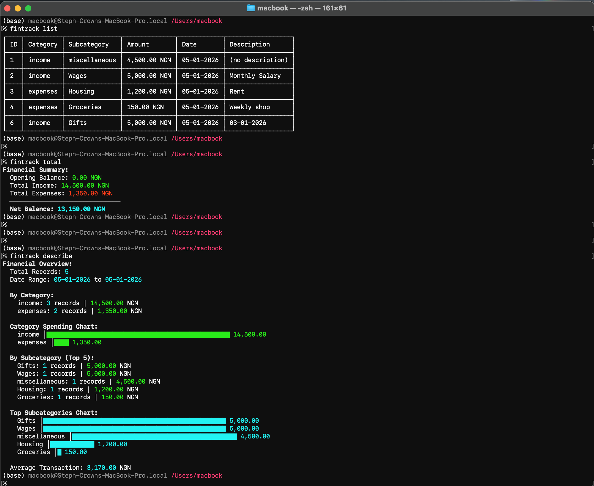

# FinTrack

> I wrote an article on how to build this CLI tool on [freeCodeCamp](https://www.freecodecamp.org/news/how-to-build-a-local-first-cli-financial-tracker-with-rust/)

<div align="center">
  
  
</div>

A local-first CLI financial tracker written in Rust. Track your income and expenses on your own machine, with zero cloud dependencies and complete data ownership.

## Table of Contents

- [Why FinTrack?](#why-fintrack)
- [Installation](#installation)
  - [macOS / Linux](#macos--linux)
  - [Windows](#windows)
  - [npm](#npm-all-platforms)
  - [Cargo](#cargo-rust-users)
- [Quick Start](#quick-start)
- [Common Commands](#common-commands)
- [Data Formats](#data-formats)
- [Data Storage](#data-storage)
- [Data Safety](#data-safety)
- [Examples](#examples)
- [Keyboard Shortcuts & Tips](#keyboard-shortcuts--tips)
- [Troubleshooting](#troubleshooting)
- [Future Features](#future-features)
- [Contributing](#contributing)
- [License](#license)

## Why FinTrack?

- **Your data stays yours.** Everything is stored locally in `~/.fintrack/`. No remote servers, no accounts, no privacy concerns.
- **Simple and fast.** Lightweight CLI tool that gets out of your way.
- **Reliable.** Simple and robust data storage ensures your data is safe.
- **Transparent.** Open-source and easy to inspect. All your financial data is in human-readable JSON.

## Installation

### macOS / Linux

#### Option 1: Homebrew (Recommended)

If you use Homebrew:

```bash
brew install steph-crown/fintrack/fintrack
```

#### Option 2: Installer Script

Run this command in your terminal:

```bash
curl --proto '=https' --tlsv1.2 -LsSf https://github.com/steph-crown/fintrack/releases/latest/download/fintrack-installer.sh | sh
```

This automatically downloads and installs FinTrack, adding it to your PATH.

#### Option 3: Manual Installation

1. Download the appropriate `.tar.xz` file from the [Releases page](https://github.com/steph-crown/fintrack/releases/latest):

   - **Apple Silicon Macs (M1/M2/M3)**: `fintrack-aarch64-apple-darwin.tar.xz`
   - **Intel Macs**: `fintrack-x86_64-apple-darwin.tar.xz`
   - **Linux (x64)**: `fintrack-x86_64-unknown-linux-gnu.tar.xz`
   - **Linux (ARM64)**: `fintrack-aarch64-unknown-linux-gnu.tar.xz`
   - **Alpine Linux**: `fintrack-x86_64-unknown-linux-musl.tar.xz`

2. Extract the archive:

   ```bash
   tar -xf fintrack-*.tar.xz
   ```

3. Move the binary to a directory in your PATH (e.g., `/usr/local/bin` or `~/.local/bin`):

   ```bash
   mv fintrack /usr/local/bin/
   ```

4. Make it executable (if needed):
   ```bash
   chmod +x /usr/local/bin/fintrack
   ```

### Windows

#### Option 1: PowerShell Installer Script (Recommended)

Open PowerShell and run:

```powershell
powershell -ExecutionPolicy Bypass -c "irm https://github.com/steph-crown/fintrack/releases/latest/download/fintrack-installer.ps1 | iex"
```

This automatically downloads and installs FinTrack, adding it to your PATH.

#### Option 2: MSI Installer

1. Download `fintrack-x86_64-pc-windows-msvc.msi` from the [Releases page](https://github.com/steph-crown/fintrack/releases/latest)
2. Double-click the `.msi` file to run the installer
3. Follow the installation wizard

#### Option 3: Manual Installation

1. Download `fintrack-x86_64-pc-windows-msvc.zip` from the [Releases page](https://github.com/steph-crown/fintrack/releases/latest)
2. Extract the ZIP file to a location like `C:\Program Files\fintrack\`
3. Add the folder to your system PATH:
   - Open "Environment Variables" in Windows Settings
   - Edit the `Path` variable
   - Add the path to the folder containing `fintrack.exe`
   - Restart your terminal

### npm (All Platforms)

If you have Node.js installed:

```bash
npm install -g fintrack
```

### Cargo (Rust Users)

If you have Rust installed, install FinTrack directly from [crates.io](https://crates.io/crates/fintrack):

```bash
cargo install fintrack
```

**Don't have Rust?** [Install Rust here](https://www.rust-lang.org/tools/install) (Rust 1.70+ required).

### Verify Installation

After installation, verify it works:

```bash
fintrack --version
```

## Quick Start

### 1. Initialize Your Tracker

```bash
fintrack init -c NGN
```

Or with opening balance:

```bash
fintrack init -c NGN -o 1000.00
```

This creates `~/.fintrack/tracker.json` and sets your currency. Supported currencies: NGN, USD, GBP, EUR, CAD, AUD, JPY.

**Flags:**

- `-c, --currency` (optional) – Currency code, defaults to NGN
- `-o, --opening` (optional) – Opening balance, defaults to 0.0

### 2. Add Your First Record

```bash
fintrack add Income 4000 -s Wages
```

Or using long flags:

```bash
fintrack add Income 4000 --subcategory Wages
```

With description and date:

```bash
fintrack add Expenses 150.50 -s Groceries -d "Weekly shop" -D 28-12-2025
```

**Arguments:**

- `category` (positional, required) – Income or Expenses
- `amount` (positional, required) – Positive number
- `-s, --subcategory` (optional) – Defaults to "miscellaneous"
- `-d, --description` (optional) – Any text
- `-D, --date` (optional) – Format: DD-MM-YYYY, defaults to today

### 3. View Your Data

```bash
fintrack list
```

See totals:

```bash
fintrack total
```

Filter by date range:

```bash
fintrack list -S 01-12-2025 -E 31-12-2025
```

Filter by category or subcategory:

```bash
fintrack list -c Income
fintrack list -s Groceries
```

View first or last N records:

```bash
fintrack list -f 5   # First 5 records
fintrack list -l 10  # Last 10 records
```

**List flags:**

- `-f, --first N` – Show first N records
- `-l, --last N` – Show last N records
- `-S, --start DATE` – Start date filter (DD-MM-YYYY)
- `-E, --end DATE` – End date filter (DD-MM-YYYY)
- `-c, --category CATEGORY` – Filter by category
- `-s, --subcategory NAME` – Filter by subcategory

### 4. Manage Categories

View all categories:

```bash
fintrack category list
```

**Note:** Categories (Income, Expenses) are immutable and cannot be created, deleted, or renamed.

### 5. Manage Subcategories

View all subcategories:

```bash
fintrack subcategory list
```

Add a new subcategory:

```bash
fintrack subcategory add Utilities
```

Delete a subcategory (only if it has no records):

```bash
fintrack subcategory delete Utilities
```

Rename a subcategory:

```bash
fintrack subcategory rename Groceries Food
```

**Subcategory commands:**

- `list` – View all subcategories
- `add <NAME>` – Create a new subcategory
- `delete <NAME>` – Delete a subcategory (must have no records)
- `rename <OLD> <NEW>` – Rename a subcategory

### 6. Update or Delete Records

Update a record by ID:

```bash
fintrack update 5 -a 200 -d "Revised amount"
```

**Update arguments:**

- `record_id` (positional, required) – Record ID to update
- `-c, --category CATEGORY` (optional) – New category
- `-a, --amount AMOUNT` (optional) – New amount
- `-s, --subcategory NAME` (optional) – New subcategory
- `-d, --description TEXT` (optional) – New description
- `-D, --date DATE` (optional) – New date

Delete records by ID(s):

```bash
fintrack delete -i 5
fintrack delete -i 1,2,3  # Multiple IDs
```

Delete all records in a category:

```bash
fintrack delete -c Expenses
```

Delete all records in a subcategory:

```bash
fintrack delete -s Groceries
```

**Delete flags (one required):**

- `-i, --ids ID1,ID2,...` – Delete by record IDs
- `-c, --by-cat CATEGORY` – Delete all records in category
- `-s, --by-subcat NAME` – Delete all records in subcategory

### 7. Explore Your Data

Get a summary with exploratory data analysis:

```bash
fintrack describe
```

This shows:

- Total records
- Date range
- Records and totals by category
- Top 5 subcategories by total
- Average transaction amount

### 8. Export Your Data

Export to CSV:

```bash
fintrack export ~/Downloads -t csv
```

Export to JSON:

```bash
fintrack export ~/Downloads -t json
```

**Export arguments:**

- `path` (positional, required) – Directory where file will be created
- `-t, --type TYPE` (optional) – File type: csv or json (defaults to json)

Files are named: `fintrack_export_YYYY-MM-DDTHH-MM-SSZ.{csv|json}`

### 9. Other Commands

View raw JSON data:

```bash
fintrack dump
```

Clear all data:

```bash
fintrack clear
```

## Common Commands

| Task                    | Command                                                      |
| ----------------------- | ------------------------------------------------------------ |
| Initialize tracker      | `fintrack init -c NGN`                                       |
| Initialize with opening | `fintrack init -c NGN -o 1000`                               |
| Add record              | `fintrack add Income 4000 -s Wages`                          |
| Add with description    | `fintrack add Expenses 150.50 -s Groceries -d "Weekly shop"` |
| Update record           | `fintrack update 5 -a 200 -d "Updated"`                      |
| List all records        | `fintrack list`                                              |
| List first 5            | `fintrack list -f 5`                                         |
| List last 10            | `fintrack list -l 10`                                        |
| Filter by category      | `fintrack list -c Income`                                    |
| Filter by date range    | `fintrack list -S 01-12-2025 -E 31-12-2025`                  |
| View totals             | `fintrack total`                                             |
| Delete record by ID     | `fintrack delete -i 5`                                       |
| Delete multiple IDs     | `fintrack delete -i 1,2,3`                                   |
| Delete by category      | `fintrack delete -c Expenses`                                |
| Delete by subcategory   | `fintrack delete -s Groceries`                               |
| View categories         | `fintrack category list`                                     |
| View subcategories      | `fintrack subcategory list`                                  |
| Add subcategory         | `fintrack subcategory add Shopping`                          |
| Rename subcategory      | `fintrack subcategory rename Old New`                        |
| Delete subcategory      | `fintrack subcategory delete Shopping`                       |
| Describe data           | `fintrack describe`                                          |
| Export to CSV           | `fintrack export ~/Downloads -t csv`                         |
| Export to JSON          | `fintrack export ~/Downloads -t json`                        |
| View raw JSON           | `fintrack dump`                                              |
| Clear all data          | `fintrack clear`                                             |
| Get help                | `fintrack help`                                              |

## Data Formats

**Dates:** DD-MM-YYYY (e.g., `30-12-2025`)

**Amounts:** Positive numbers only (e.g., `4000` or `150.50`)

**Names:** Alphanumeric, start with a letter (e.g., "Groceries", "Utilities_Bill")

## Data Storage

All your data is stored locally:

```
~/.fintrack/
├── tracker.json           # Your financial data
└── backups/               # Directory for future backup functionality
```

You can safely back up the entire `~/.fintrack/` directory to protect your data.

## Data Safety

You can view your current data anytime:

```bash
fintrack dump
```

This pretty-prints your `tracker.json` to the terminal.

**Note:** Automatic backups are not currently implemented. It's recommended to manually back up your `~/.fintrack/` directory periodically.

## Examples

### Track Monthly Income and Expenses

```bash
# Add monthly salary
fintrack add Income 50000 -s Wages -D 01-12-2025

# Add rent
fintrack add Expenses 20000 -s Housing -D 01-12-2025

# Add groceries
fintrack add Expenses 5000 -s Groceries -D 10-12-2025
fintrack add Expenses 4500 -s Groceries -D 20-12-2025

# View summary
fintrack total

# See expenses by category
fintrack list -c Expenses
```

### Review Last Week's Spending

```bash
fintrack list -l 7
```

### See Income for the Year

```bash
fintrack list -c Income -S 01-01-2025 -E 31-12-2025
```

### Correct a Mistake

```bash
fintrack list -l 5        # Find the wrong record
fintrack update 42 -a 300  # Correct it
```

### Analyze Your Spending

```bash
fintrack describe
```

This provides insights like:

- Total records and date range
- Spending breakdown by category
- Top subcategories
- Average transaction amount

## Keyboard Shortcuts & Tips

- Use `fintrack help` to see all available commands
- Flag order doesn't matter: `-c Income -a 4000` is the same as `-a 4000 -c Income`
- Category and subcategory names are case-insensitive (use "wages", "Wages", or "WAGES"—all work)
- Dates default to today if not specified
- Descriptions are optional but helpful for future reference
- Use `fintrack describe` to get insights into your spending patterns

## Troubleshooting

### "Tracker already initialized"

You've already run `fintrack init` once. If you want to start fresh, run:

```bash
fintrack clear
```

Then `fintrack init` again.

### "Subcategory does not exist"

View all available subcategories:

```bash
fintrack subcategory list
```

Then use the exact name from the list.

### "Cannot delete subcategory—it has X records"

You must delete all records in that subcategory first, or delete the subcategory and all its records at once:

```bash
fintrack delete -s Groceries
```

### Data seems corrupted or missing

Run:

```bash
fintrack dump
```

to inspect your data. If something is wrong, you may need to restore from a manual backup or start fresh with `fintrack clear` and `fintrack init`.

## Future Features

Coming soon:

- **PDF Export:** Export your data to PDF format
- **Shell Autocompletion:** Tab-complete commands and category names
- **Configuration file:** Customize defaults and display preferences

## Contributing

Found a bug? Want a feature? Open an issue or pull request on [GitHub](https://github.com/steph-crown/fintrack).

## License

MIT License. See LICENSE file for details.

---

## Want to Know More?

Interested in the technical design and architecture decisions behind FinTrack? Check out the **[Design Document](./docs/design.md)** for a comprehensive deep-dive into how the tool is built, including data structures, error handling, and the reasoning behind each decision.

---

**Get started now:** `fintrack init -c NGN`
